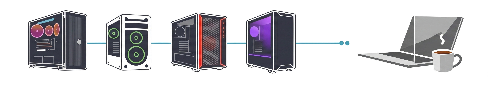
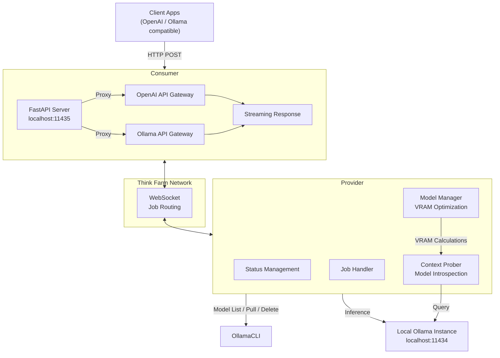

# thinkfarm



A distributed local LLM inference sharing system that lets you **provide** your local Ollama models to a network and **consume** models from other nodes - all presented through a unified **OpenAI-compatible API**.

Visit [www.thinkfarm.net](https://www.thinkfarm.net) for the full project site.

Think Farm consists of two roles:

| Role         | What it does                                                                                                                                                                      |
| ------------ | --------------------------------------------------------------------------------------------------------------------------------------------------------------------------------- |
| **Provider** | Registers a node on the Think Farm network, allowing it to serve its local Ollama models to consumers. Optionally auto-manages which models are pulled and loaded based on available storage.                                                           |
| **Consumer** | Listens to the network for available models and presents them as a local server (`localhost:11435`) with OpenAI-compatible endpoints (`/chat`, `/generate`, `/embeddings`, etc.). |

## Architecture



**Data flow:**

1. **Client** sends request to the Consumer's local server (e.g., `http://localhost:11435/v1/chat/completions`)
2. **Consumer** selects an available model and routes the request via WebSocket to the Think Farm network
3. **Provider** receives the job, pulls/loads the model on its local Ollama instance if needed, and executes the inference
4. Results stream back through the network to the Consumer, then to the Client

## Screenshots

### Provider

The Provider GUI lets you set your node's identity, optionally configure model storage preferences, and toggle automatic model management:


The top panel lists remote models available from the network with their VRAM requirements. The bottom panel shows your local provider models with checkboxes for how each should be used (preload, load, as embedding).

### Consumer

The Consumer GUI lists available remote models from the Think Farm network, with VRAM requirements and provider information:


The top panel lists discoverable models with context length, VRAM requirements, and the providing node. The bottom panel shows locally managed models. You can filter and select which models to expose via the local API server.

## Quick Start

### Prerequisites

- Python 3.10+
- [Ollama](https://ollama.com) installed and running locally
- [pip](https://pip.pypa.io/)

### Installation

```bash
# Install dependencies
pip install -r requirements.txt
```

### Provider Setup

The Provider exposes your local Ollama models to the Think Farm network. There are three ways to run it, each targeting a different deployment scenario:

#### 1. Linux — Base Provider (`baseprovider.py`)

The base provider connects to an **existing external Ollama instance** (e.g., already running on `localhost:11434`). This is the recommended option for Linux servers and desktops where Ollama is already installed and managed.

```bash
python -m provider.baseprovider
```

**Key config (in `~/.thinkfarm/config.ini`):**
- `ollama_url` — URL of your external Ollama instance
- `provider_id`, `managed_storage_gb`, `auto_manage` — same as below

No additional Ollama setup needed — it uses whatever Ollama is already running.

#### 2. Windows — Provider (`provider.py`)

The Windows provider **manages its own internal Ollama server** automatically — it starts and stops a dedicated Ollama instance on a random port and handles model storage separately. Use this on Windows or any system where you want Think Farm to fully manage Ollama.

```bash
python -m provider.provider
```

**Key config (in `~/.thinkfarm/config.ini`):**
- `ollama_models_path` — Optional custom path for Ollama model storage (e.g., `D:\Ollama\Models`)
- `provider_id`, `managed_storage_gb`, `auto_manage` — same as below

> **Note:** The Ollama URL is no longer configured manually — the provider starts its own instance internally.

#### 3. Headless — CLI for Servers (`headless.py`)

No GUI at all — a headless mode designed for **headless servers, Docker containers, or systemd services** where terminal interaction is preferred.

```bash
# Start the provider in the foreground
python -m provider.headless start

# Check status
python -m provider.headless status

# Stop the provider
python -m provider.headless stop
```

Or use it with systemd:
```ini
[Service]
ExecStart=python -m provider.headless start
PIDFile=~/.thinkfarm/provider.pid
Restart=on-failure
```

| Config option | Purpose |
|---|---|
| `ollama_url` | URL of the external Ollama instance to connect to |
| `provider_id` | Unique identifier for this provider node |
| `managed_storage_gb` | Maximum disk storage for models (default: 30) |
| `auto_manage` | Whether to automatically pull/unload models (true/false) |

When auto_manage is enabled, the provider also introspects each model's context window and manages storage within your configured limit.

### Consumer Setup

The Consumer presents available remote models as a local server compatible with Ollama's API and the OpenAI API format.

```bash
# PyQt6 GUI (recommended)
python -m consumer.qclient

# Legacy Tkinter GUI (deprecated)
python -m consumer.consumer

# FastAPI server only (no GUI)
python -m consumer.main
```

The Consumer:

- Connects to the Think Farm network and discovers available models.
- Runs a local FastAPI server on `localhost:11435`.
- Proxies `/v1/chat/completions`, `/v1/completions`, `/v1/embeddings`, and Ollama-compatible endpoints to the selected provider.
- Supports streaming responses and configurable model whitelisting/filters.
- Tray-icon aware - minimize to system tray instead of closing.

### Configuration

Configuration is stored in `~/.thinkfarm/config.ini`:

```ini
[provider]
ollama_url = http://localhost:11434
server_port = 11436

[consumer]
server_url = https://app.thinkfarm.net
server_port = 11435
consumer_id = your-unique-id
```

An `.env` file can also be used in the project directory:

```ini
SERVER_URL=https://app.thinkfarm.net
OLLAMA_URL=http://localhost:11434
```

## Endpoints

Once the Consumer is running, it exposes the following endpoints at `http://localhost:11435`:

### OpenAI-Compatible

| Endpoint               | Method | Description                            |
| ---------------------- | ------ | -------------------------------------- |
| `/v1/chat/completions` | POST   | Chat completions (streaming supported) |
| `/v1/completions`      | POST   | Legacy completions                     |
| `/v1/embeddings`       | POST   | Embeddings                             |
| `/v1/models`           | GET    | Available models                       |
| `/v1/responses`        | POST   | OpenAI Responses API                   |

### Ollama-Compatible

| Endpoint        | Method | Description                    |
| --------------- | ------ | ------------------------------ |
| `/api/generate` | POST   | Generate text                  |
| `/api/chat`     | POST   | Chat with messages             |
| `/api/embed`    | POST   | Generate embeddings            |
| `/api/tags`     | GET    | List available models          |
| `/api/ps`       | GET    | Check current inference status |
| `/health`       | GET    | Health check                   |
| `/version`      | GET    | Version info                   |

## Provider Internals

### Components

| File                         | Purpose                                                                          |
| ---------------------------- | -------------------------------------------------------------------------------- |
| `provider/solo.py`           | Core provider logic: status management, job handling, WebSocket communication    |
| `provider/model_manager.py`  | VRAM-aware model portfolio optimization                                          |
| `provider/context_prober.py` | Ollama model introspection (context limits, prefill info, model metadata)        |
| `provider/ollama_client.py`  | Ollama API client wrapper (model list, pull, delete, generate, chat, embeddings) |
| `provider/provider.py`       | GUI application for the Provider                                                 |
| `provider/baseprovider.py`   | Base class shared by Provider implementations                                    |
| `provider/headless.py`       | CLI front-end (start/stop/status via PID)                                        |

### Model Management

The Provider uses a three-tier model management system:

1. **Context Probing** - discovers model context windows and prefill limits by querying Ollama directly.
2. **Model Manager** - calculates VRAM requirements and optimizes which models to keep loaded.
3. **Managed Model Loop** - continuously monitors availability and demand, pulling/unloading models to maintain the optimal portfolio.

## Consumer Internals

| File                   | Purpose                                                                    |
| ---------------------- | -------------------------------------------------------------------------- |
| `consumer/main.py`     | FastAPI application: routing, streaming, OpenAI + Ollama API compatibility |
| `consumer/consumer.py` | **Legacy** — Core Tkinter GUI (deprecated; use `qclient.py`)                |
| `consumer/qclient.py`  | **Primary** — PyQt6 GUI wrapper with system tray and cross-platform support  |

### Features

- **Model filtering** - select which remote models to expose locally.
- **Whitelist management** - control which models are available for inference.
- **Server health polling** - automatically checks and reconnects to the Think Farm network.
- **Streaming inference** - supports real-time streaming responses.
- **System tray** - non-intrusive background operation on desktop.

## Development

```bash
# Run the provider in headless mode
cd provider
python headless.py start

# Run the consumer
cd consumer
python main.py
```

## Requirements

```
customtkinter==5.2.2
fastapi
httpx==0.28.1
pyqt6
python-dotenv==1.2.2
websockets==16.0
```

> **Note:** This repository is a partial copy derived from the 2llamashare project.

---

Built with ❤️ for local LLM enthusiasts.
