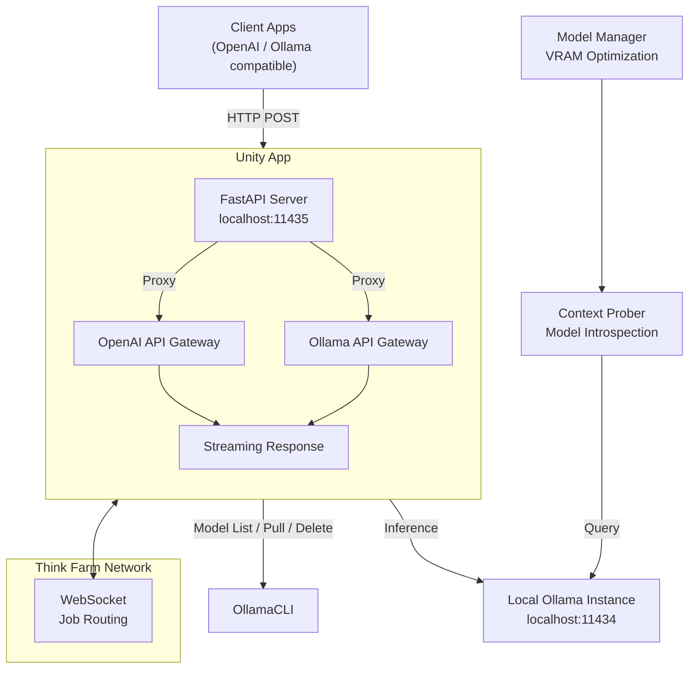

# thinkfarm


A distributed local LLM inference sharing system that lets you **provide** your local Ollama models to a network and **consume** models from other nodes - all presented through a unified **OpenAI-compatible API**.

Visit [www.thinkfarm.net](https://www.thinkfarm.net) for the full project site.

Think Farm consists of two roles:

| Role         | What it does                                                                                                                                                                      |
| ------------ | --------------------------------------------------------------------------------------------------------------------------------------------------------------------------------- |
| **Provider + Consumer (Unity)** | Full dual-purpose node: serves your local Ollama models to the network *and* consumes models from other nodes, all in one unified app with auto-management. |
| **Consumer** | Pure consumer — listens to the network for available models and presents them as a local server (`localhost:11435`) with OpenAI-compatible endpoints. No provisioning capability. |

## Architecture



**Data flow:**

1. **Client** sends request to the Unity app's local server (e.g., `http://localhost:11435/v1/chat/completions`)
2. **Unity** acts as consumer, selecting an available model and routing the request via WebSocket to the Think Farm network
3. If the requesting node is also a provider, Unity routes locally; otherwise the request goes to another provider on the network
4. The responding node loads/pulls the model if needed and executes inference
5. Results stream back through the network to the Unity app, then to the Client

## Quick Start

### Prerequisites

- Python 3.10+
- [Ollama](https://ollama.com) installed and running locally
- [pip](https://pip.pypa.io/)

### Installation

```bash
# Install dependencies
pip install -r requirements.txt
```

### Unity Setup (Provider + Consumer)

Unity is the single unified app that acts as both provider and consumer. It has one entry point for all platforms:

```bash
python -m unity.main
```

**Key config** (in `~/.thinkfarm/config.ini`):
- `ollama_url` — URL of your external Ollama instance (base provider mode)
- `ollama_models_path` — Optional custom path for Ollama model storage (managed mode, Windows)
- `provider_id`, `managed_storage_gb`, `auto_manage` — control model auto-management

The Unity app starts an internal FastAPI server on `localhost:11435` and handles everything:
- Discovering remote models from the Think Farm network
- Serving your own Ollama models to consumers
- Auto-pulling/unloading models based on VRAM, RAM, and demand
- Tray-icon aware — minimize to system tray instead of closing

When `auto_manage` is enabled, the app introspects each model's context window, computes GPU/VRAM requirements, and optimizes your model portfolio within your storage limit.

#### Base Provider Mode (Existing Ollama)

If Ollama is already running on an external URL (e.g., `localhost:11434`), configure the URL in `config.ini`:

```ini
[provider]
ollama_url = http://localhost:11434
```

Unity will connect to that Ollama instance and use it for serving models.

#### Managed Mode (Ollama Managed by Unity)

On Windows or when you want Think Farm to fully manage Ollama, remove `ollama_url` from config. Unity will start and stop its own internal Ollama instance automatically:

```ini
[provider]
# ollama_url removed — unity manages its own Ollama
ollama_models_path = D:\\Ollama\\Models  ; optional custom storage path
managed_storage_gb = 30
auto_manage = true
```

### Consumer Setup (Pure Consumer)

For users who only want to **consume** models from the network (not provide their own): 

```bash
# PyQt6 GUI (recommended, cross-platform)
python -m consumer.qclient

# Legacy Tkinter GUI (deprecated)
python -m consumer.consumer

# FastAPI server only (no GUI)
python -m consumer.main
```

Consumer-only mode connects to the Think Farm network, discovers available models, and exposes them at `localhost:11435` via OpenAI-compatible endpoints. No provisioning capability — use Unity if you need both.

## Screenshots

### Unity (Provider + Consumer)


The top panel lists available models from the network and your local provider models with VRAM requirements. The bottom panel shows connection status, model management controls, and logging.

### Consumer (Standalone)

The standalone Consumer GUI lists available remote models from the Think Farm network, with VRAM requirements and provider information:


The top panel lists discoverable models with context length, VRAM requirements, and the providing node. The bottom panel shows locally managed models. You can filter and select which models to expose via the local API server.


### Configuration

Both Unity and Consumer share the same config file at `~/.thinkfarm/config.ini`. Only the settings you use are required — unused sections can be omitted:

```ini
[provider]
# Ollama connection: leave empty for Unity-managed mode (internal Ollama)
ollama_url = http://localhost:11434  ; or remove for managed mode
ollama_models_path = D:\\Ollama\\Models  ; optional, managed mode only
provider_id = your-node-name
managed_storage_gb = 30
auto_manage = true

[consumer]
server_url = https://app.thinkfarm.net
server_port = 11435
consumer_id = your-unique-id
```

An `.env` file can also be used in the **project directory**:

```ini
SERVER_URL=https://app.thinkfarm.net
OLLAMA_URL=http://localhost:11434
```

## Endpoints

Both Unity (when running) and the standalone Consumer expose the following endpoints at `http://localhost:11435`:

### OpenAI-Compatible

| Endpoint               | Method | Description                            |
| ---------------------- | ------ | -------------------------------------- |
| `/v1/chat/completions` | POST   | Chat completions (streaming supported) |
| `/v1/completions`      | POST   | Legacy completions                     |
| `/v1/embeddings`       | POST   | Embeddings                             |
| `/v1/models`           | GET    | Available models                       |
| `/v1/responses`        | POST   | OpenAI Responses API                   |

### Ollama-Compatible

| Endpoint        | Method | Description                    |
| --------------- | ------ | ------------------------------ |
| `/api/generate` | POST   | Generate text                  |
| `/api/chat`     | POST   | Chat with messages             |
| `/api/embed`    | POST   | Generate embeddings            |
| `/api/tags`     | GET    | List available models          |
| `/api/ps`       | GET    | Check current inference status |
| `/health`       | GET    | Health check                   |
| `/version`      | GET    | Version info                   |

## Unity Internals (Provider + Consumer)

Unity merges provider and consumer into a single application. Its components live in `unity/`:

### Components

| File | Purpose |
|---|---|
| `main.py` | **Entry point** — launches the PyQt6 UI (single entry for all platforms) |
| `app_gui.py` | Main GUI window: model filtering, tray icon, log display, client/provider toggle |
| `client_server.py` | FastAPI proxy server: routes requests to local Ollama or remote providers |
| `config.py` | `ConfigManager` — INI-style config persistence |
| `context_prober.py` | System probing: GPU VRAM, RAM, context pressure, custom Modelfile management |
| `model_manager.py` | Model scoring: VRAM-aware portfolio optimization, managed storage |
| `provider_client.py` | Ollama lifecycle: start/stop/restart, model sync, status heartbeats, job monitoring |
| `headless.py` | CLI mode for non-GUI environments (`python -m unity.headless`) |

### Model Management

Unity uses a three-tier model management system:

1. **Context Probing** — discovers model context windows and prefill limits by querying Ollama directly.
2. **Model Manager** — calculates VRAM requirements (via NVIDIA GPU probing) and optimizes which models to keep loaded.
3. **Managed Model Loop** — continuously monitors availability and demand, pulling/unloading models to maintain the optimal portfolio within storage limits.

## Consumer Internals (Standalone)

For users running only the consumer (`python -m consumer.qclient`):

| File | Purpose |
|---|---|
| `consumer/main.py` | FastAPI application: routing, streaming, OpenAI + Ollama API compatibility |
| `consumer/consumer.py` | **Legacy** — Core Tkinter GUI (deprecated; use `qclient.py`) |
| `consumer/qclient.py` | **Primary** — PyQt6 GUI wrapper with system tray and cross-platform support |

### Features

- **Model filtering** — select which remote models to expose locally.
- **Whitelist management** — control which models are available for inference.
- **Server health polling** — automatically checks and reconnects to the Think Farm network.
- **Streaming inference** — supports real-time streaming responses.
- **System tray** — non-intrusive background operation on desktop.

## Development

```bash
# Unity (provider + consumer, all platforms)
python -m unity.main

# Consumer only (stays behind)
cd consumer
python qclient.py

# Headless CLI mode
python -m unity.headless start
```

## Requirements

```
customtkinter==5.2.2
fastapi
httpx==0.28.1
pyqt6
python-dotenv==1.2.2
websockets==16.0
```

> **Note:** This repository is a partial copy derived from the 2llamashare project.


---

Built with ❤️ for local LLM enthusiasts.
