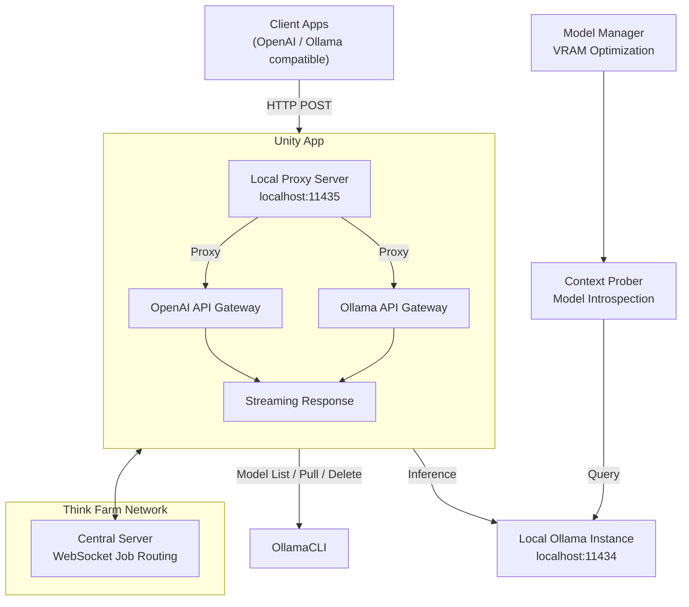

# thinkfarm


A distributed local LLM inference sharing system that lets you **provide** your local Ollama models to a network and **consume** models from other nodes - all presented through a unified **Ollama- and OpenAI-compatible API**.

Visit [www.thinkfarm.net](https://www.thinkfarm.net) for the full project site.

Think Farm consists of two roles:

| Role         | What it does                                                                                                                                                                      |
| ------------ | --------------------------------------------------------------------------------------------------------------------------------------------------------------------------------- |
| **Provider + Consumer (Unity)** | Full dual-purpose node: serves your local Ollama models to the network *and* consumes models from other nodes, all in one unified app with auto-management. |
| **Consumer** | Pure consumer — listens to the network for available models and presents them as a local server (`localhost:11435`) with Ollama- and OpenAI-compatible endpoints. No provisioning capability. |

## Architecture



**Data flow:**

1. **Client** sends a request to the app's local proxy (e.g., `http://localhost:11435/v1/chat/completions`)
2. The app forwards it to the central server, which routes the job over a WebSocket to a provider — preferring providers that already have the model loaded in VRAM (so a node that is both provider and consumer can serve its own requests)
3. The selected provider loads the model if needed and executes inference against its local Ollama
4. Results stream back through the network to the local proxy, then to the Client

## Quick Start

### Prerequisites

- Python 3.10+
- [Ollama](https://ollama.com) installed and running locally (for provider role)
- [pip](https://pip.pypa.io/)

### Installation

There is no single root dependency file — install the app you want to run:

```bash
# Unity (provider + consumer)
pip install -r unity/requirements.txt

# or standalone consumer
pip install -r consumer/requirements.txt
```

### Unity Setup (Provider + Consumer)

Unity is the single unified app that acts as both provider and consumer:

```bash
cd unity
python main.py          # GUI (PyQt6, tray-icon aware)
# or
python headless.py      # provider-only, no GUI (same config files)
```

The Unity app can start a local proxy on `localhost:11435` (toggle in the GUI) and handles everything:
- Discovering remote models from the Think Farm network
- Serving your own Ollama models to consumers on the network
- Auto-pulling/unloading models based on VRAM, RAM, and demand
- Tray-icon aware — minimize to system tray instead of closing

#### Base Provider Mode (Existing Ollama)

If Ollama is already running, point Unity at it in `config.ini` (or the GUI):

```ini
[provider]
LOCAL_OLLAMA_URL = http://localhost:11434
```

Unity will connect to that Ollama instance and use it for serving models. On non-Windows platforms you can also set `OLLAMA_RESTART_CMD` if you want Unity to be able to restart Ollama.

#### Managed Mode (Ollama Managed by Unity, Windows)

On Windows the app defaults to fully managing its own Ollama instance: it starts/stops Ollama, pulls models into your model storage, and prunes them to fit your budget. Configure via the GUI or:

```ini
[provider]
OLLAMA_MODELS_PATH = D:\Ollama\Models   ; optional custom storage path
GB_ALLOWED = 30                          ; storage budget for managed models
AUTO_MANAGE_MODELS = true
```

When `AUTO_MANAGE_MODELS` is enabled, the app introspects each model's context window, computes GPU/VRAM requirements, and optimizes your model portfolio within the storage budget.

### Consumer Setup (Pure Consumer)

For users who only want to **consume** models from the network (not provide their own):

```bash
cd consumer
python qclient.py       # PyQt6 GUI (recommended, cross-platform, tray icon)
# or
python consumer.py      # CustomTkinter GUI (legacy)
# or, headless proxy only:
uvicorn main:app --port 11435
```

Consumer-only mode connects to the Think Farm network, discovers available models, and exposes them at `localhost:11435` via Ollama- and OpenAI-compatible endpoints. No provisioning capability — use Unity if you need both.

## Screenshots

### Unity (Provider + Consumer)

The top panel lists available models from the network and your local provider models with VRAM requirements. The bottom panel shows connection status, model management controls, and logging.


### Consumer (Standalone)

The standalone Consumer GUI lists available remote models from the Think Farm network, with VRAM requirements and provider information:


The top panel lists discoverable models with context length, VRAM requirements, and the providing node. The bottom panel shows locally managed models. You can filter and select which models to expose via the local API server.

## Configuration

Both Unity and Consumer share the same config file at `~/.thinkfarm/config.ini` (managed by the GUIs — the sections are written for you when you save settings). Only the settings you use are required — unused sections can be omitted:

```ini
[provider]
PROVIDER_ID = <auto-generated, unique per machine>
SLOTS = 1
# Base provider mode (non-managed Ollama):
LOCAL_OLLAMA_URL = http://localhost:11434
OLLAMA_RESTART_CMD =
# Managed mode (Windows):
OLLAMA_MODELS_PATH = D:\Ollama\Models
GB_ALLOWED = 30
AUTO_MANAGE_MODELS = true
CONTEXT_PRESSURE = 0.90

[consumer]
CONSUMER_ID = <your registered consumer id>
CLIENT_PORT = 11435
WHITELIST_ENABLED = false
WHITELIST_MODELS =
```

The central server address is set via a `.env` file in the app directory (defaults to `https://app.thinkfarm.net`):

```ini
# unity/.env
CENTRAL_SERVER_URL=https://app.thinkfarm.net

# consumer/.env
SERVER_URL=https://app.thinkfarm.net
```

## Endpoints

Both Unity (with its local proxy running) and the standalone Consumer expose the following endpoints at `http://localhost:11435`:

### OpenAI-Compatible

| Endpoint               | Method | Description                            |
| ---------------------- | ------ | -------------------------------------- |
| `/v1/chat/completions` | POST   | Chat completions (streaming supported) |
| `/v1/completions`      | POST   | Legacy completions                     |
| `/v1/responses`        | POST   | OpenAI Responses API                   |
| `/v1/models`           | GET    | Available models                       |

### Ollama-Compatible

| Endpoint        | Method | Description                    |
| --------------- | ------ | ------------------------------ |
| `/api/generate` | POST   | Generate text                  |
| `/api/chat`     | POST   | Chat with messages             |
| `/api/embed`    | POST   | Generate embeddings            |
| `/api/embeddings` | POST | Generate embeddings (alt path) |
| `/api/tags`     | GET    | List available models          |
| `/api/ps`       | GET    | Check current inference status |
| `/api/show`     | POST   | Model details / prompt         |
| `/`             | GET    | Health check                   |
| `/version`      | GET    | Version info                   |

## Unity Internals (Provider + Consumer)

Unity merges provider and consumer into a single application. Its components live in `unity/`:

### Components

| File | Purpose |
|---|---|
| `main.py` | **Entry point** — launches the PyQt6 UI (`python main.py` from `unity/`) |
| `app_gui.py` | Main GUI window: model filtering, tray icon, log display, client/provider toggle |
| `client_server.py` | Local FastAPI proxy server (port 11435): Ollama + OpenAI API compatibility, model whitelist, `num_ctx` injection |
| `config.py` | `ConfigManager` — INI-style config persistence (`~/.thinkfarm/config.ini` + `.env`) |
| `context_prober.py` | System probing: GPU VRAM, RAM, context pressure, custom context-capped model creation |
| `model_manager.py` | Model scoring: VRAM-aware portfolio optimization, managed storage |
| `provider_client.py` | WebSocket provider client: job execution, performance monitoring, heartbeats, Ollama lifecycle |
| `headless.py` | CLI mode for non-GUI environments (`python headless.py` from `unity/`) |

### Model Management

Unity uses a three-tier model management system:

1. **Context Probing** — discovers model context windows and prefill limits by querying Ollama directly, estimating KV-cache/VRAM pressure from available RAM and GPU.
2. **Model Manager** — calculates VRAM requirements (via NVIDIA GPU probing) and scores model suitability for the local hardware.
3. **Managed Model Loop** — continuously monitors availability and demand, pulling/unloading models to maintain the optimal portfolio within the storage budget.

## Consumer Internals (Standalone)

For users running only the consumer (`python qclient.py` from `consumer/`):

| File | Purpose |
|---|---|
| `consumer/main.py` | FastAPI application: routing, streaming, OpenAI + Ollama API compatibility |
| `consumer/consumer.py` | **Legacy** — CustomTkinter GUI (use `qclient.py` instead) |
| `consumer/qclient.py` | **Primary** — PyQt6 GUI with system tray, min-to-tray, and cross-platform support |

### Features

- **Model filtering** — select which remote models to expose locally.
- **Whitelist management** — control which models are available for inference.
- **Server health polling** — automatically checks and reconnects to the Think Farm network.
- **Streaming inference** — supports real-time streaming responses.
- **System tray** — non-intrusive background operation on desktop.

## Development

```bash
# Unity (provider + consumer)
cd unity
python main.py

# Consumer only
cd consumer
python qclient.py

# Headless provider
cd unity
python headless.py
```

## Requirements

```
customtkinter==5.2.2
fastapi
httpx==0.28.1
pyqt6
python-dotenv
websockets==16.0
```

See `unity/requirements.txt` and `consumer/requirements.txt` for pinned, complete lists.

> **Note:** This repository is a partial copy derived from the 2llamashare project.


---

Built with ❤️ for local LLM enthusiasts.
