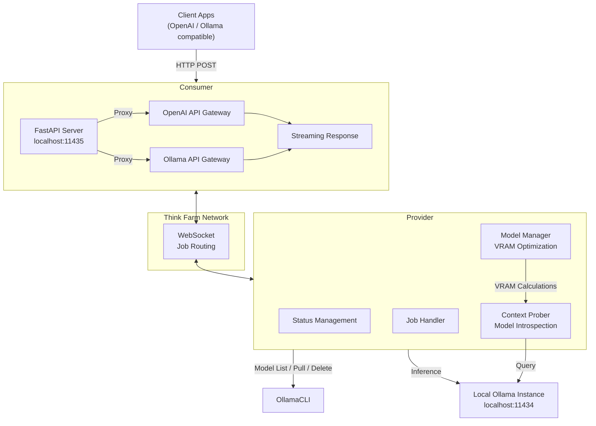
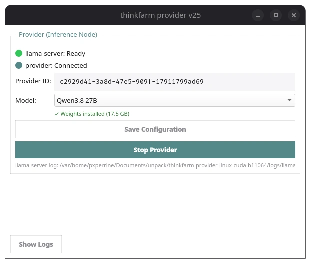
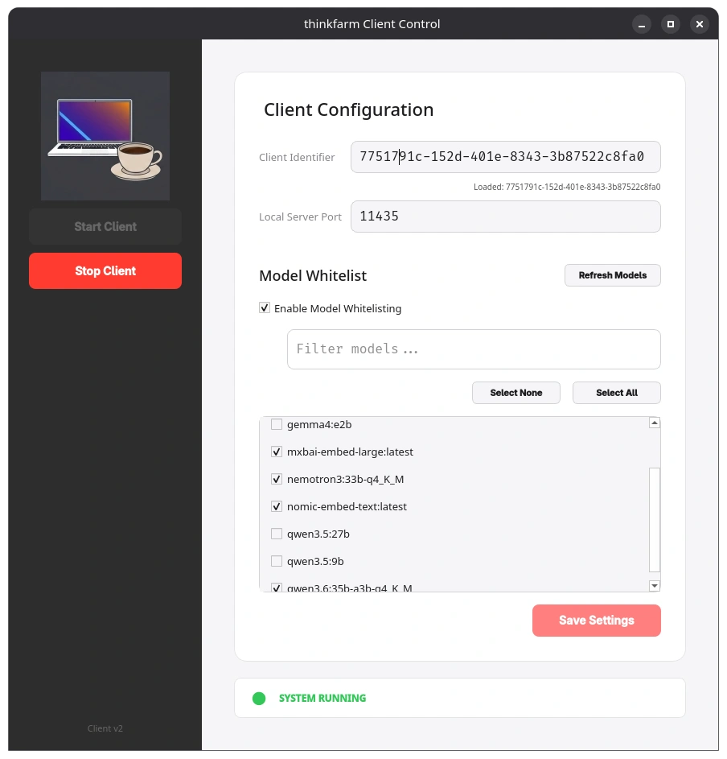

# thinkFarm

A distributed local LLM inference sharing system that lets you **provide** your local Ollama models to a network and **consume** models from other nodes - all presented through a unified **OpenAI-compatible API**.

Visit [www.thinkfarm.net](https://www.thinkfarm.net) for the full project site.

Think Farm consists of two roles:

| Role         | What it does                                                                                                                                                                      |
| ------------ | --------------------------------------------------------------------------------------------------------------------------------------------------------------------------------- |
| **Provider** | Exposes your local Ollama models to the Think Farm network, with smart VRAM-aware model management and context probing.                                                           |
| **Consumer** | Listens to the network for available models and presents them as a local server (`localhost:11435`) with OpenAI-compatible endpoints (`/chat`, `/generate`, `/embeddings`, etc.). |

## Architecture



**Data flow:**

1. **Client** sends request to the Consumer's local server (e.g., `http://localhost:11435/v1/chat/completions`)
2. **Consumer** selects an available model and routes the request via WebSocket to the Think Farm network
3. **Provider** receives the job, pulls/loads the model on its local Ollama instance if needed, and executes the inference
4. Results stream back through the network to the Consumer, then to the Client

## Screenshots

### Provider

The Provider GUI shows your local Ollama models and their VRAM requirements, with the option to preload, load, or use as embedding models:



The top panel lists remote models available from the network with their VRAM requirements. The bottom panel shows your local provider models with checkboxes for how each should be used (preload, load, as embedding).

### Consumer

The Consumer GUI lists available remote models from the Think Farm network, with VRAM requirements and provider information:



The top panel lists discoverable models with context length, VRAM requirements, and the providing node. The bottom panel shows locally managed models. You can filter and select which models to expose via the local API server.

## Quick Start

### Prerequisites

- Python 3.10+
- [Ollama](https://ollama.com) installed and running locally
- [pip](https://pip.pypa.io/)

### Installation

```bash
# Install dependencies
pip install -r requirements.txt
```

### Provider Setup

The Provider exposes your local Ollama models to the Think Farm network.

```bash
# Headless / CLI mode
python -m provider.headless start

# Check status
python -m provider.headless status

# Stop
python -m provider.headless stop
```

Or use the GUI:

```bash
python -m provider.provider
```

The Provider manages:

- **Model lifecycle** - automatically pulls, loads, and unloads models based on demand and VRAM constraints.
- **Context probing** - introspects each model's context window and prefill limits via Ollama.
- **VRAM optimization** - maintains a model portfolio that fits within available GPU memory.

### Consumer Setup

The Consumer presents available remote models as a local server compatible with Ollama's API and the OpenAI API format.

```bash
# GUI mode (recommended)
python -m consumer.consumer

# Or launch directly
python -m consumer.main
```

The Consumer:

- Connects to the Think Farm network and discovers available models.
- Runs a local FastAPI server on `localhost:11435`.
- Proxies `/v1/chat/completions`, `/v1/completions`, `/v1/embeddings`, and Ollama-compatible endpoints to the selected provider.
- Supports streaming responses and configurable model whitelisting/filters.
- Tray-icon aware - minimize to system tray instead of closing.

### Configuration

Configuration is stored in `~/.thinkfarm/config.ini`:

```ini
[provider]
ollama_url = http://localhost:11434
server_port = 11436

[consumer]
server_url = https://app.thinkfarm.net
server_port = 11435
consumer_id = your-unique-id
```

An `.env` file can also be used in the project directory:

```ini
SERVER_URL=https://app.thinkfarm.net
OLLAMA_URL=http://localhost:11434
```

## Endpoints

Once the Consumer is running, it exposes the following endpoints at `http://localhost:11435`:

### OpenAI-Compatible

| Endpoint               | Method | Description                            |
| ---------------------- | ------ | -------------------------------------- |
| `/v1/chat/completions` | POST   | Chat completions (streaming supported) |
| `/v1/completions`      | POST   | Legacy completions                     |
| `/v1/embeddings`       | POST   | Embeddings                             |
| `/v1/models`           | GET    | Available models                       |
| `/v1/responses`        | POST   | OpenAI Responses API                   |

### Ollama-Compatible

| Endpoint        | Method | Description                    |
| --------------- | ------ | ------------------------------ |
| `/api/generate` | POST   | Generate text                  |
| `/api/chat`     | POST   | Chat with messages             |
| `/api/embed`    | POST   | Generate embeddings            |
| `/api/tags`     | GET    | List available models          |
| `/api/ps`       | GET    | Check current inference status |
| `/health`       | GET    | Health check                   |
| `/version`      | GET    | Version info                   |

## Provider Internals

### Components

| File                         | Purpose                                                                          |
| ---------------------------- | -------------------------------------------------------------------------------- |
| `provider/solo.py`           | Core provider logic: status management, job handling, WebSocket communication    |
| `provider/model_manager.py`  | VRAM-aware model portfolio optimization                                          |
| `provider/context_prober.py` | Ollama model introspection (context limits, prefill info, model metadata)        |
| `provider/ollama_client.py`  | Ollama API client wrapper (model list, pull, delete, generate, chat, embeddings) |
| `provider/provider.py`       | GUI application for the Provider                                                 |
| `provider/baseprovider.py`   | Base class shared by Provider implementations                                    |
| `provider/headless.py`       | CLI front-end (start/stop/status via PID)                                        |

### Model Management

The Provider uses a three-tier model management system:

1. **Context Probing** - discovers model context windows and prefill limits by querying Ollama directly.
2. **Model Manager** - calculates VRAM requirements and optimizes which models to keep loaded.
3. **Managed Model Loop** - continuously monitors availability and demand, pulling/unloading models to maintain the optimal portfolio.

## Consumer Internals

| File                   | Purpose                                                                    |
| ---------------------- | -------------------------------------------------------------------------- |
| `consumer/main.py`     | FastAPI application: routing, streaming, OpenAI + Ollama API compatibility |
| `consumer/consumer.py` | Core consumer logic (model filters, whitelist, server polling)             |
| `consumer/qclient.py`  | PyQt6 GUI wrapper with system tray support                                 |

### Features

- **Model filtering** - select which remote models to expose locally.
- **Whitelist management** - control which models are available for inference.
- **Server health polling** - automatically checks and reconnects to the Think Farm network.
- **Streaming inference** - supports real-time streaming responses.
- **System tray** - non-intrusive background operation on desktop.

## Development

```bash
# Run the provider in headless mode
cd provider
python headless.py start

# Run the consumer
cd consumer
python main.py
```

## Requirements

```
customtkinter==5.2.2
fastapi
httpx==0.28.1
pyqt6
python-dotenv==1.2.2
websockets==16.0
```

> **Note:** This repository is a partial copy derived from the 2llamashare project.

---

Built with ❤️ for local LLM enthusiasts.
