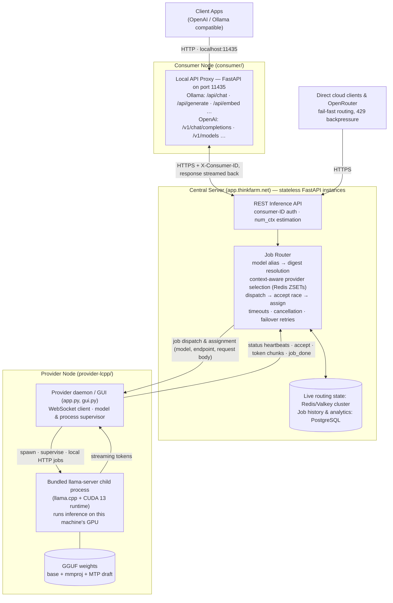

# thinkfarm


A distributed local LLM inference sharing system that lets you **provide** models to a network and **consume** models from other nodes — all presented through a unified **Ollama- and OpenAI-compatible API**.

Visit [www.thinkfarm.eu](https://www.thinkfarm.eu) for the full project site.

Think Farm consists of two roles:

| Role | What it does |
|---|---|
| **Provider** (`provider-lcpp`) | Self-contained provider node: spawns and manages bundled `llama-server` (llama.cpp) to serve high-performance GGUF models (with vision projectors & MTP draft speculative decoding) to the Think Farm network. **No Ollama or CUDA toolkit required** — only an NVIDIA GPU driver. |
| **Consumer** (`consumer`) | Pure consumer node: connects to the network to discover available models and presents them as a local server (`localhost:11435`) with Ollama- and OpenAI-compatible endpoints. |

## Architecture

Think Farm has three moving parts: a **consumer app** that presents network models as a local Ollama/OpenAI API, a **central server** (`app.thinkfarm.net`) that routes inference jobs, and **provider nodes** that run the actual inference on their own hardware. The provider app bundles its inference engine directly — it spawns and supervises its own `llama-server` (llama.cpp) child process and executes every job locally; it is not a proxy for Ollama or any other pre-existing runner.



**The central server.** It runs as multiple stateless FastAPI instances sharing live routing state in a Redis/Valkey cluster: provider status, per-model idle sets scored by context window, and active-job tracking. Completed jobs (provider, model, token counts, duration) are persisted to PostgreSQL for history, performance analytics, and revenue reporting. The same REST inference API also fronts Think Farm's hosted models for direct cloud clients — including OpenRouter, where capacity is advertised per slot (RPM/TPM scaled by an operator-set capacity factor) and the server fails fast with `429` backpressure instead of queueing when no provider is idle.

**Data flow:**

1. **Client** sends a request to the consumer's local proxy (e.g., `http://localhost:11435/v1/chat/completions` or `http://localhost:11435/api/generate`).
2. The consumer forwards it over HTTPS to the central server with its `X-Consumer-ID`, and — when no context size was specified — estimates a safe `num_ctx` from the request body so long prompts aren't silently truncated by provider defaults.
3. The **central server** resolves the model name (or alias) to a content digest, queries Redis for idle providers whose context window fits, dispatches the job over each candidate's WebSocket (up to 7), runs a short accept race so competing acceptances are drawn fairly, and assigns the winner along with the endpoint and request body. If no idle provider accepts in time it falls back to busy/higher-context providers; if the first token doesn't arrive within ~90 s it cancels that job and retries on another provider (up to 3 attempts).
4. The **provider** executes the job against its own bundled `llama-server` child process — inference runs on the node's own GPU, not a remote or third-party service — translating Ollama-format jobs into llama.cpp's OpenAI-compatible API as needed, and streams tokens back over the WebSocket in ~75 ms batches.
5. The central server relays chunks down the consumer's HTTPS stream (SSE for OpenAI endpoints, NDJSON for Ollama ones); the consumer pipes them through to the client unchanged. When the provider reports `job_done` with token counts, the server records a job row for history and analytics.

## Quick Start

### Prerequisites

- **Python 3.10+**
- **For Provider:** Linux x86_64 with an NVIDIA GPU driver supporting CUDA 13+ (driver 580+/590+). No CUDA toolkit or Ollama installation is required; all runtime libraries and binaries are self-contained.
- **For Consumer:** Any platform supporting Python 3.10+ with network access to the Think Farm central server.

---

### Provider Setup (`provider-lcpp`)

The provider app is self-contained: it manages its own `llama-server` process, handles model weight downloads, and runs either with a full PyQt6 GUI dashboard or as a headless CLI daemon.

```bash
cd provider-lcpp

# 1. Start the PyQt6 GUI dashboard (default)
./thinkfarm.sh

# 2. Or run as a headless background daemon
./thinkfarm.sh --headless

# 3. Download model weights directly from the CLI
./thinkfarm.sh --download
```

#### One-Command Launcher (`thinkfarm.sh`)

`thinkfarm.sh` automatically detects or sets up a Python virtual environment (`./venv`), installs required dependencies (`httpx`, `websockets`, and `PyQt6` for GUI), and falls back to bundled offline wheels if available.

#### CLI Options

| Command | Description |
|---|---|
| `./thinkfarm.sh` | Launch the PyQt6 GUI dashboard (closing window minimizes to system tray; Exit quits). |
| `./thinkfarm.sh --headless` | Run as a headless daemon in the foreground (Ctrl+C to stop cleanly). |
| `./thinkfarm.sh --download` | Download required model weights for the default model with resumable chunked downloads & SHA-256 verification. |
| `./thinkfarm.sh --model <NAME>` | Select a specific model (e.g. `qwen3.8-27b`, `qwen3.6-35b`). Can be combined with `--headless` or `--download`. |

#### Supported Models

Models are defined in individual folders with vision projectors and speculative decoding support:

- `qwen3.8-27b/` (default) — `Qwen3.8-27B-UD-Q4_K_M.gguf`, `mmproj-BF16.gguf`, `mtp-Qwen3.8-27B-Q4_0.gguf` (MTP draft model for fast speculative decoding).
- `qwen3.6-35b/` — `Qwen3.6-35B-A3B-UD-Q4_K_M.gguf`, `mmproj-BF16.gguf`.

If model files are not yet present, you can click **Download Model** in the GUI dashboard or run `./thinkfarm.sh --download`.

---

### Consumer Setup (`consumer`)

For machines that only need to **consume** models from the network and expose a local OpenAI/Ollama API:

```bash
cd consumer

# Install dependencies
pip install -r requirements.txt

# Run the PyQt6 GUI client (recommended)
python qclient.py

# Or run the headless API proxy
uvicorn main:app --port 11435
```

The Consumer connects to the Think Farm network, discovers models provided by active network nodes, and makes them accessible locally at `http://localhost:11435`.

## Screenshots

### Provider Dashboard (`provider-lcpp`)

The PyQt6 dashboard provides real-time status indicators (child server, WebSocket connection, worker state), model selector, weight downloader with progress bars, configuration settings, and activity logs.


### Consumer GUI (`consumer`)

The standalone Consumer GUI lists available remote models from the Think Farm network with context lengths, VRAM requirements, and providing nodes:


## Configuration

### Provider Configuration

The provider stores its configuration in `~/.thinkfarm/custom.ini` (managed via the GUI or edited directly):

```ini
[provider]
PROVIDER_ID = <auto-generated or custom unique ID>
SLOTS = 1
MODEL = qwen3.8-27b
```

Environment variables:
- `CENTRAL_SERVER_URL` (in `.env` or environment, default: `https://app.thinkfarm.net`): Central server endpoint.
- `LOCAL_PORT`: Pin the local `llama-server` port (default: free ephemeral port).
- `READY_TIMEOUT`: Maximum seconds to wait for `llama-server` initialization (default: `1800`).

### Consumer Configuration

The consumer reads configuration from `~/.thinkfarm/config.ini`:

```ini
[consumer]
CONSUMER_ID = <your consumer ID>
CLIENT_PORT = 11435
WHITELIST_ENABLED = false
WHITELIST_MODELS =
```

Environment variables:
- `SERVER_URL` (in `consumer/.env`, default: `https://app.thinkfarm.net`): Central server endpoint.

## API Endpoints

The Consumer node exposes the following endpoints on `http://localhost:11435`:

### OpenAI-Compatible

| Endpoint | Method | Description |
|---|---|---|
| `/v1/chat/completions` | POST | Chat completions (supports streaming) |
| `/v1/completions` | POST | Legacy text completions |
| `/v1/responses` | POST | OpenAI Responses API |
| `/v1/models` | GET | List available network models |

### Ollama-Compatible

| Endpoint | Method | Description |
|---|---|---|
| `/api/generate` | POST | Generate text / completion |
| `/api/chat` | POST | Chat with messages |
| `/api/embed` | POST | Generate embeddings |
| `/api/embeddings` | POST | Generate embeddings (alternate path) |
| `/api/tags` | GET | List available models |
| `/api/ps` | GET | Active inference status |
| `/api/show` | POST | Model details & prompt template |
| `/` | GET | Server health check |
| `/version` | GET | API version info |

## Provider Internals (`provider-lcpp`)

| File / Directory | Purpose |
|---|---|
| `thinkfarm.sh` | One-command launcher script with automatic virtualenv creation, offline wheel fallback, and CLI argument parsing. |
| `gui.py` | PyQt6 dashboard: configuration form, live connection dots, download manager, log viewer, and system tray integration. |
| `app.py` | Headless provider daemon & process supervisor: spawns child `llama-server`, monitors readiness, handles signals, and routes WebSocket jobs. |
| `downloader.py` | Resumable chunked model downloader with HTTP Range requests, SHA-256 integrity verification, and disk space pre-checks. |
| `lcpp/` | Core provider client implementation and WebSocket communication protocol. |
| `bin/` | Pre-built `llama-server` binary and GGML runtime shared libraries (older bundles used `llama-b11064/`). |
| `cudart/` | Bundled CUDA 13.3 runtime libraries (older bundles used `cudart-llama-b11064-bin-ubuntu-cuda-13.3-x64/`; on Windows the DLLs are co-located in `bin/`). |

## Consumer Internals (`consumer`)

| File | Purpose |
|---|---|
| `qclient.py` | Primary PyQt6 GUI: model selection, whitelist filtering, and system tray management. |
| `main.py` | FastAPI application serving the local OpenAI/Ollama proxy on port 11435. |
| `consumer.py` | Legacy CustomTkinter GUI. |

---

Built with ❤️ for local LLM enthusiasts.
