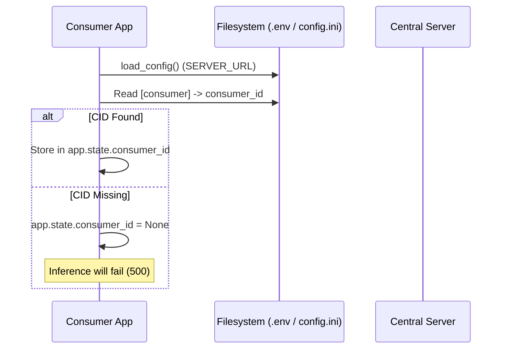
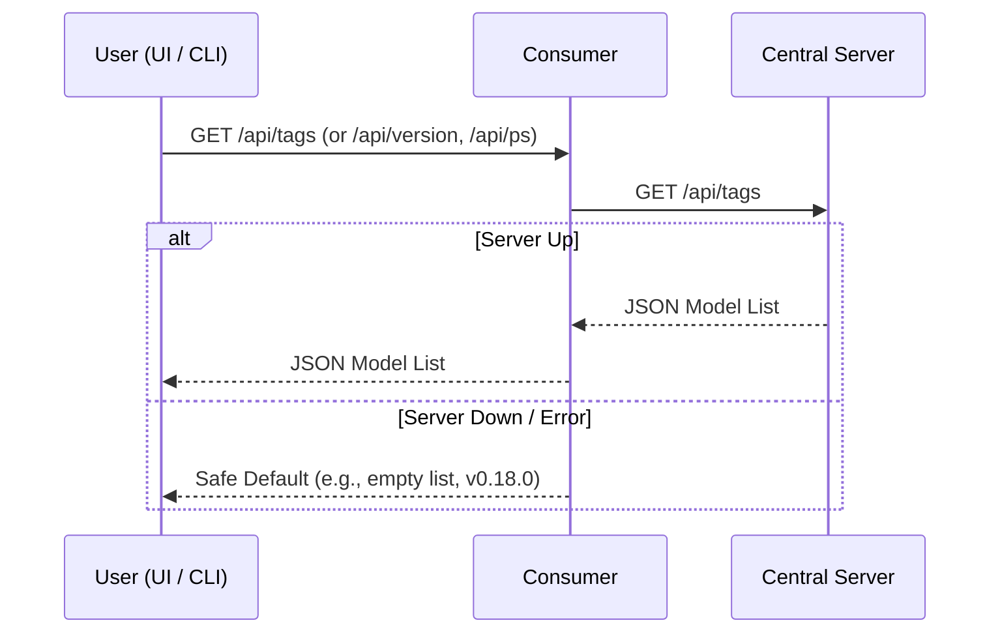
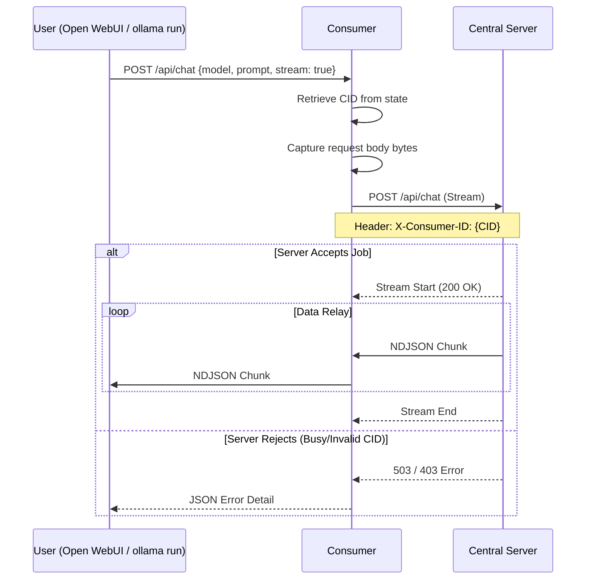

# thinkfarm Consumer — Architectural Workflow

This document describes the operational logic of the thinkfarm Consumer (`consumer/main.py`), which acts as a local proxy that presents a distributed cluster as a standard local Ollama instance.

## 1. Startup & Initialization

The consumer identifies itself using a unique Consumer ID (CID) and connects to the central server.

---

## 2. Metadata Passthrough (Tags & Versions)

The consumer mirrors the local Ollama API by fetching metadata from the central server.

---

## 3. Distributed Inference Proxy

The core responsibility of the consumer is to forward inference requests while injecting the `X-Consumer-ID` header for server-side routing and logging.

---

## 4. Key Logic Components

### The `_stream_to_server` Mechanism
Unlike simple metadata endpoints, inference uses a high-performance streaming relay:
1.  **Identity Injection**: Every request is tagged with the `X-Consumer-ID` header.
2.  **Zero-Buffer Streaming**: Chunks are yielded back to the user as soon as they arrive from the central server, ensuring minimal latency.
3.  **Error Propagation**: If the central server returns an error (e.g., "No providers available"), the consumer parses the error detail and raises a corresponding `HTTPException` back to the user.

### Protocol Compatibility
The consumer supports multiple API dialects simultaneously:
- **Ollama Native**: `/api/chat`, `/api/generate`, `/api/show`, etc.
- **OpenAI Compatible**: `/v1/chat/completions`, `/v1/completions`, and `/v1/models`.
- **Legacy Embeddings**: Handles both `/api/embeddings` and the newer `/api/embed` formats.

---

## 5. Configuration Summary

| Key | Source | Description |
|---|---|---|
| `SERVER_URL` | `.env` | The base URL of the thinkfarm central server. |
| `consumer_id` | `config.ini` | The unique UUID identifying this consumer for usage tracking. |
| **Local Port** | Default | Listens on port `11434` by default. Override via `config.ini` or the UI. |
