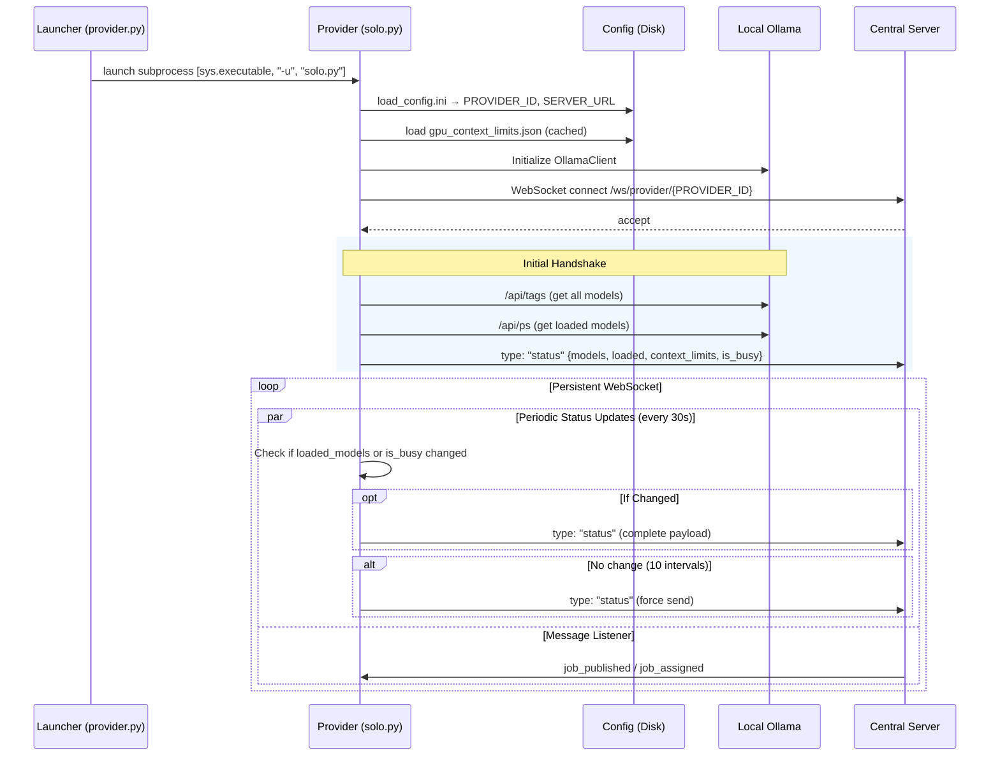
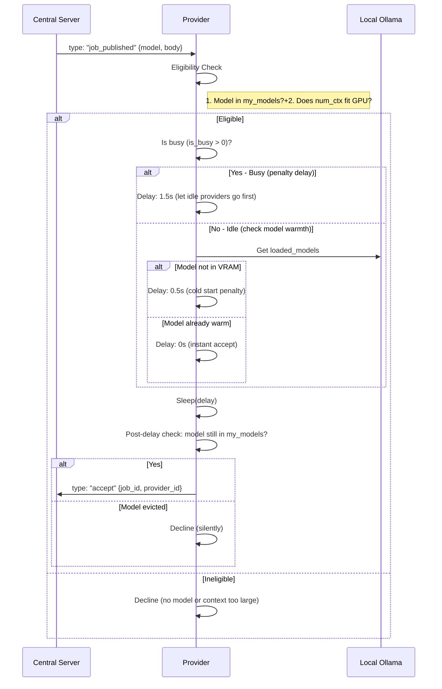
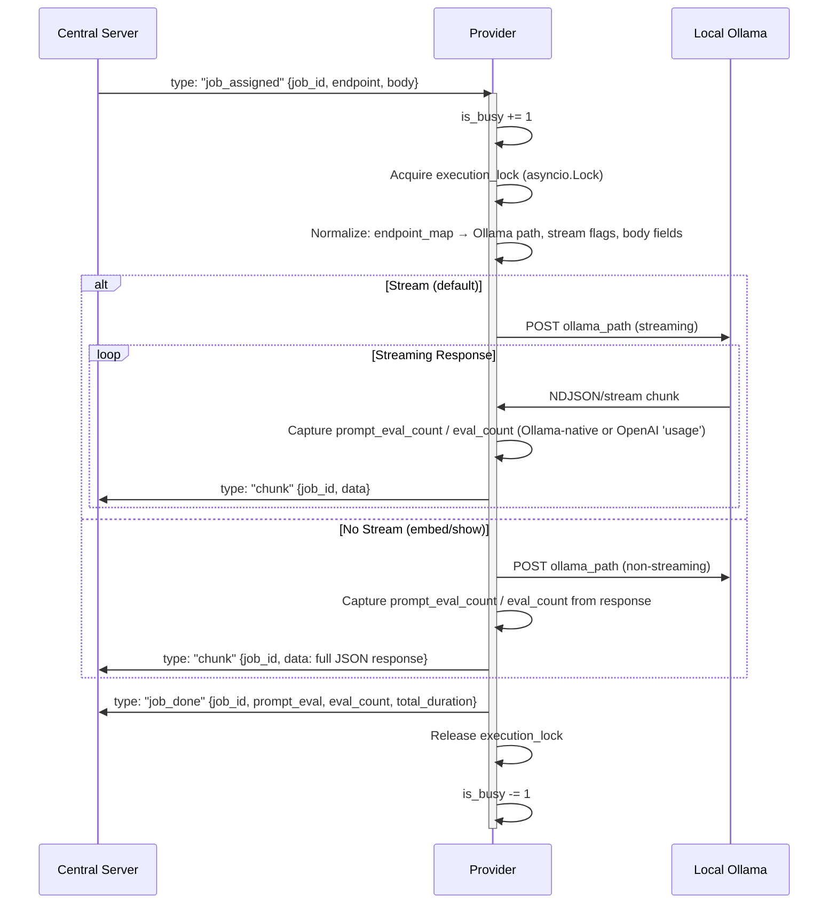

# llamashare Provider — Architectural Workflow

This document details the operational logic of the LlamaShare Provider system, which consists of two files:

- **`provider.py`** — GUI front-end launcher (starts/stops the provider, manages config)
- **`solo.py`** — Core provider logic (WebSocket lifecycle, job acceptance, inference execution)

The standalone provider `solo.py` connects local Ollama instances to the distributed cluster, acting as a drop-in replacement for `main.py` to avoid FastAPI overhead.

## 1. Startup & Connection Lifecycle

The system consists of two processes:

1. **`provider.py` (Launcher)** — A customtkinter GUI application that loads config and can launch `solo.py` as a subprocess
2. **`solo.py` (Provider)** — The core logic that manages the WebSocket lifecycle

When launched via `provider.py`, the launcher starts `solo.py` with `subprocess.Popen([sys.executable, "-u", "solo.py"])`. When PyInstaller frozen, it dispatches via `--solo` / `--probe` flags.

Inside `solo.py`:

---

## 2. The "Smart Race" (Job Acceptance)

When `job_published` arrives, the provider uses a **tiered delay** system. A busy provider waits longer; a cold model waits a bit; a warm model accepts instantly. After the delay, the provider checks if the model is still available (it may have been evicted during the wait).

---

## 3. Job Execution & Streaming

Once the server confirms the provider won the race, it begins the inference execution. Only one job runs at a time per provider to protect VRAM.

The provider normalizes the incoming request before dispatching to Ollama:

| Endpoint | Normalization |
|---|---|
| Embed | Remaps `prompt` → `input`, forces `stream=False` |
| Show | Remaps `model` → `name`, forces `stream=False` |
| v1/* (OpenAI) | Adds `stream_options: {include_usage: true}` when streaming |

---

## 4. Key Logic Components

### Eligibility & Context Filtering
Before accepting a job, the provider calls `_context_fits()`. This checks the requested `num_ctx` against a local cache of GPU context limits (`gpu_context_limits.json`). If the limit is 0, the provider accepts optimistically (uncached). This prevents "Out of Memory" (OOM) errors that would occur if the model were offloaded to CPU or crashed during a long request.

### Request Normalization
The provider acts as a compatibility layer, mapping various incoming request formats to the specific requirements of the local Ollama version:

| Endpoint Type | Mapping |
|---|---|
| Embeddings | Remaps `prompt` → `input` for `/api/embed` |
| Show | Remaps `model` → `name` for `/api/show` |
| Embeddings/Show | Forces `stream=False` |
| OpenAI-compatible (v1/*) | Adds `stream_options: {include_usage: true}` when streaming; forwards paths directly |
| Endpoint routing | Maps keys (`chat`, `generate`, `embed`, `v1/chat/completions`, etc.) via `_ENDPOINT_MAP` |

### Usage Count Capture
Streaming responses capture usage statistics from **both** formats:
- Ollama native: `prompt_eval_count` / `eval_count` per chunk
- OpenAI compatible: `usage.prompt_tokens` / `usage.completion_tokens`

### Periodic Status Updates (30s interval)
The provider sends updates via `_get_changed_loaded_status()`, which checks if `loaded_models` or `is_busy` changed. If nothing changed, it only sends when a change is detected — **except every 10th heartbeat**, where it forces a full status push to keep the server's data fresh.

The `_previous_status` object tracks `models`, `loaded_models`, and `is_busy` as frozensets for change detection.

### Concurrency Control
- **`is_busy`**: An integer counter of active or queued jobs. Used to signal state to the server and calculate "Smart Race" delays.
- **`execution_lock`**: A global `asyncio.Lock` that serializes the actual hitting of the Ollama API, preventing multiple heavy inference tasks from competing for the same GPU.

---

## 5. State Summary

| Variable | Scope | Description |
|---|---|---|
| `PROVIDER_ID` | Config | Unique identifier for this machine (from `config.ini`). |
| `my_models` | Local | Set of all models available in the local Ollama catalog. |
| `loaded_models`| Local | Set of models currently warm in VRAM (from `/api/ps`). |
| `gpu_context_limits` | Disk | Map of model names to max safe `num_ctx` values. |
| `is_busy` | Local | Global counter used for scheduling and priority. |
| `execution_lock` | Local | Lock ensuring serial inference execution. |
